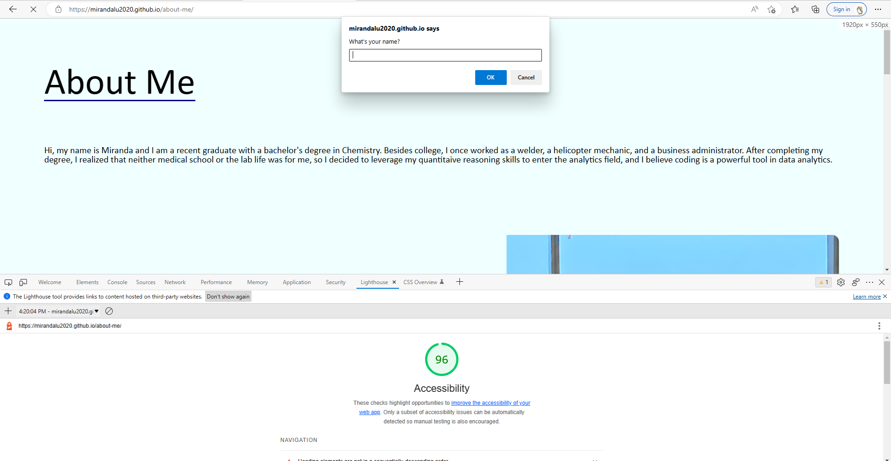

# projects-201, lab 2

## About Me

This is a project that builds a website that's about me. I explored basic HTML, CSS, and JavaScript on the webiste. 

### Author: Miranda Lu

### Links and Resources

- [HTML Documentation](https://www.w3schools.com/html/default.asp)
- [CSS Documentation](https://www.w3schools.com/css/default.asp)
- [JavaScript Documentatin](https://www.w3schools.com/js/default.asp)

### Reflections and Comments

- This website was made without any functions, so it was very tedious to write when there were repeated `if` statements. This project made me really apprecate using functions.
